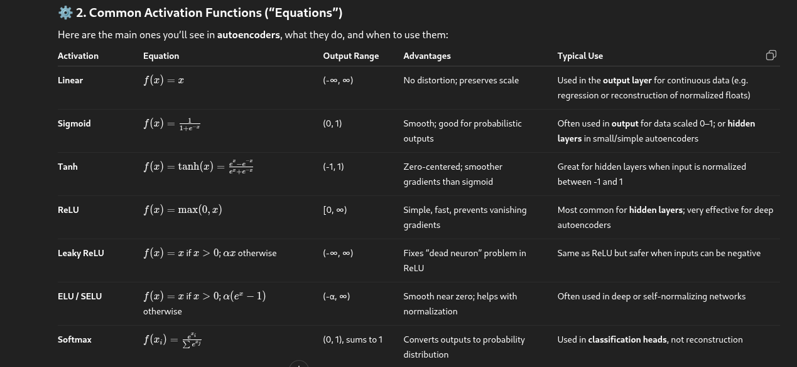

# Equations 

This folder will explore how different equation effect the autoencoder while we figure out the best combinbination for the autoencoder 

Table for equations

The equations used by the Dutch was 

Sigmoid for the encoder and ReLU for the decoder 

| Layer            | Activation        | Why                                                   |
| ---------------- | ----------------- | ----------------------------------------------------- |
| Input            | —                 | Normalized feature vector                             |
| Hidden (Encoder) | ReLU or Tanh      | Nonlinear compression                                 |
| Bottleneck       | Linear            | Keeps latent features interpretable                   |
| Hidden (Decoder) | ReLU or Tanh      | Nonlinear reconstruction                              |
| Output           | Sigmoid or Linear | Sigmoid if features are normalized 0–1, Linear if not |