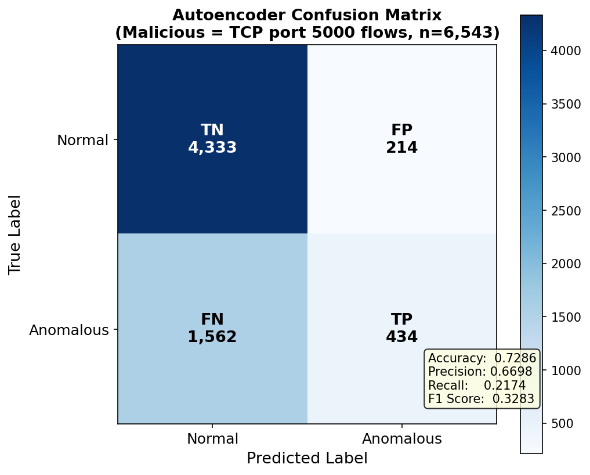
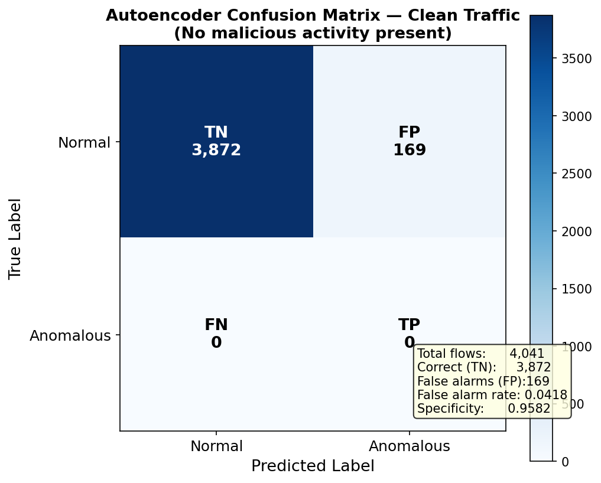
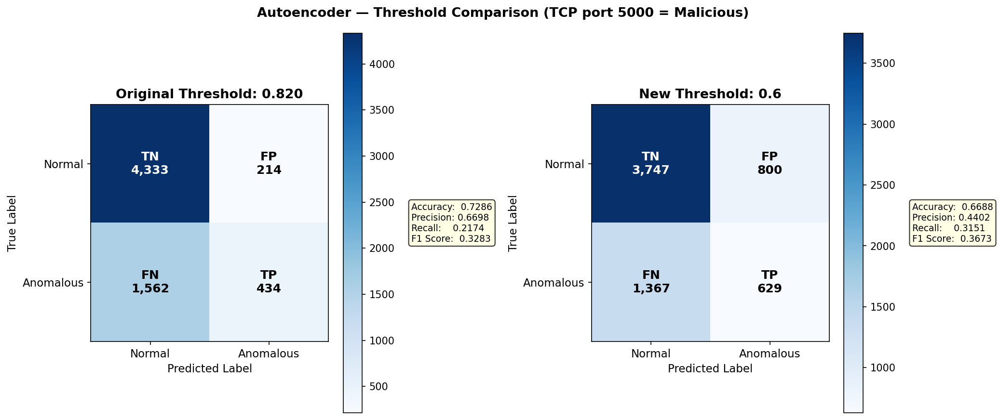
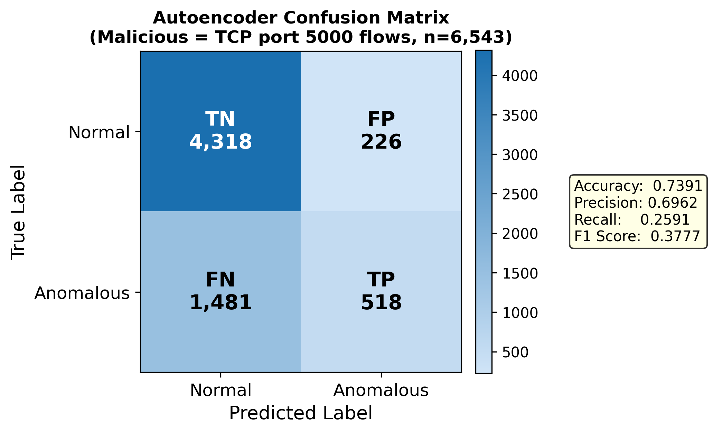
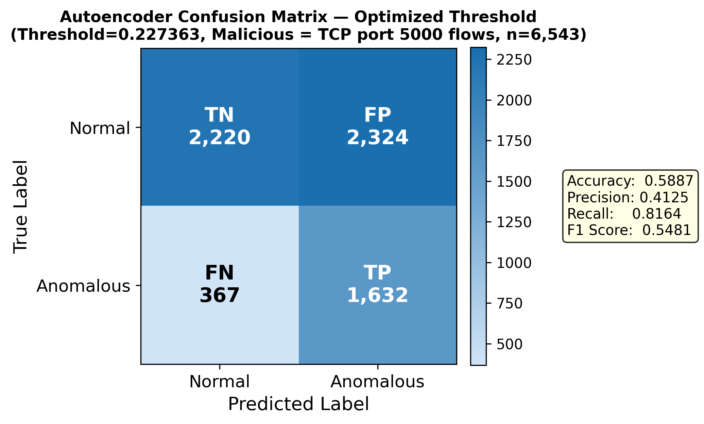
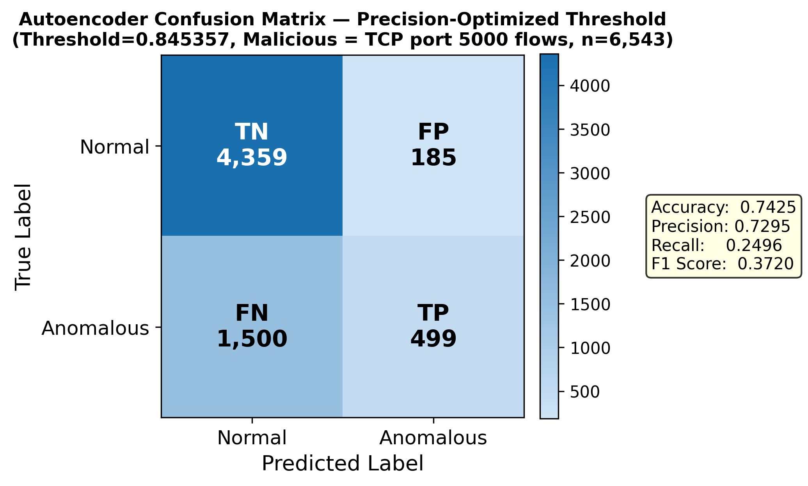

# Confusion Matrices

This folder contains confusion matrices generated from the FlowMAE anomaly detection model.
Ground truth throughout is: **TCP flows involving port 5000 = malicious** (data exfiltration),
all other flows = normal.

---

## How to Read a Confusion Matrix

A confusion matrix compares what the model predicted against what was actually true.
Every flow falls into one of four cells:

| | Predicted Normal | Predicted Anomalous |
|---|---|---|
| **Actually Normal** | TN — correct, ignored | FP — false alarm |
| **Actually Malicious** | FN — missed attack | TP — caught attack |

- **TP (True Positive)** — malicious flow correctly flagged
- **TN (True Negative)** — normal flow correctly ignored
- **FP (False Positive)** — normal flow wrongly flagged as malicious (false alarm)
- **FN (False Negative)** — malicious flow missed entirely

---

## Metrics Explained

### Accuracy
```
Accuracy = (TP + TN) / (TP + TN + FP + FN)
```
The fraction of all flows the model got right. Intuitive, but misleading when
classes are imbalanced. Since there are roughly twice as many normal flows as
malicious ones, a model that flags *nothing* would still score ~69% accuracy —
making accuracy a poor standalone measure here.

### Precision
```
Precision = TP / (TP + FP)
```
"Of everything we flagged, how many were actually malicious?"
High precision means few false alarms — when the model raises an alert, it is
usually right. Important when investigating alerts is costly.

### Recall
```
Recall = TP / (TP + FN)
```
"Of all the actual malicious flows, how many did we catch?"
High recall means few missed attacks. Low recall means attackers can exfiltrate
data and the model will not notice most of it.

### F1 Score
```
F1 = 2 * (Precision * Recall) / (Precision + Recall)
```
The harmonic mean of precision and recall. A single balanced score — you cannot
inflate it by sacrificing one metric for the other. Useful when you need to
compare models with a single number.

### The Core Trade-off

Precision and recall are always in tension via the detection threshold:

- **Raise threshold** → fewer flags → fewer FPs → higher precision, lower recall
- **Lower threshold** → more flags → more TPs but also more FPs → higher recall, lower precision

Which matters more depends on the operational context:
- Catching every attack → prioritize **recall**
- Minimising alert fatigue → prioritize **precision**

---

## Matrices

### 1. confusion_matrix.png — Baseline Model


The first full evaluation of the original FlowMAE model trained on clean TCP with
SSL traffic (`flow_clean_tcp_withssl`), tested against mixed traffic at the trained
threshold of **0.820**.

| Metric | Value |
|--------|-------|
| Accuracy | 0.7286 |
| Precision | 0.6698 |
| Recall | 0.2174 |
| F1 Score | 0.3283 |
| TP | 434 |
| TN | 4,333 |
| FP | 214 |
| FN | 1,562 |

The model is fairly conservative — when it flags something it is usually right
(67% precision) but it only catches about 1 in 5 malicious flows. The 1,562
false negatives represent exfiltration flows that scored below the threshold
and were silently let through.

---

### 2. confusion_matrix_clean.png — Clean Traffic Baseline


A sanity-check run on purely clean traffic with **no malicious flows present**.
There are no TPs or FNs by definition — the only interesting numbers are FPs
(false alarms on normal traffic).

| Metric | Value |
|--------|-------|
| Total flows | 4,041 |
| TN (correct) | 3,872 |
| FP (false alarms) | 169 |
| False alarm rate | 4.18% |
| Specificity (TN rate) | 0.9582 |

The model correctly ignores 95.8% of normal flows. The 169 false alarms are
flows whose reconstruction error happened to exceed the threshold despite being
benign — acceptable background noise for an unsupervised anomaly detector.

---

### 3. confusion_matrix_threshold_comparison.png — Threshold Comparison


A side-by-side view of the baseline model at two thresholds: the original
trained value (**0.820**) versus a manually lowered value (**0.6**).

| | Threshold 0.820 | Threshold 0.6 |
|---|---|---|
| Accuracy | 0.7286 | 0.6688 |
| Precision | 0.6698 | 0.4402 |
| Recall | 0.2174 | 0.3151 |
| F1 Score | 0.3283 | 0.3673 |
| FP | 214 | 800 |
| FN | 1,562 | 1,367 |

Lowering the threshold catches more attacks (recall 21% → 31%) but at the cost
of nearly 4x more false alarms (214 → 800). F1 improves slightly, showing the
lower threshold is a better overall balance — but precision drops sharply.

---

### 4. confusion_matrix_further_trained.png — Further Trained Model


The further trained model (`further_trained`) was created by continuing
training from the original baseline using `New_tcps_withssl.pcap` as additional
benign data. The threshold was capped at the original value and did not
increase (`0.820461`).

| Metric | Value |
|--------|-------|
| Accuracy | 0.7391 |
| Precision | 0.6962 |
| Recall | 0.2591 |
| F1 Score | 0.3777 |
| TP | 518 |
| TN | 4,318 |
| FP | 226 |
| FN | 1,481 |

Additional training on more benign traffic improved every metric slightly over
the baseline: precision up from 67% to 70%, recall up from 22% to 26%, and F1
up from 0.33 to 0.38. The model has a better understanding of what normal looks
like, making it slightly more decisive.

---

### 5. confusion_matrix_further_trained_optimized.png — F1-Optimized Threshold


The threshold for the further trained model was swept across all possible values
and the point that maximised the **F1 score** was selected (`0.227363`).

| Metric | Value |
|--------|-------|
| Accuracy | 0.5887 |
| Precision | 0.4125 |
| Recall | 0.8164 |
| F1 Score | 0.5481 |
| TP | 1,632 |
| TN | 2,220 |
| FP | 2,324 |
| FN | 367 |

Recall jumps dramatically from 26% to **82%** — the model now catches most
exfiltration flows. However, false positives explode to 2,324, meaning more
than half of all flagged flows are actually normal traffic. This threshold
is appropriate if missing an attack is far more costly than investigating
false alarms.

---

### 6. confusion_matrix_further_trained_precision_opt.png — Precision-Optimized Threshold


The threshold was swept and the point that maximised the **F-beta score with
beta=0.5** was selected (`0.845357`). Beta < 1 weights precision more heavily
than recall, finding the best balance while minimising false alarms.

| Metric | Value |
|--------|-------|
| Accuracy | 0.7425 |
| Precision | 0.7295 |
| Recall | 0.2496 |
| F1 Score | 0.3720 |
| TP | 499 |
| TN | 4,359 |
| FP | 185 |
| FN | 1,500 |

False positives are reduced to **185** (the lowest of any threshold tested)
while precision reaches **73%**. The model only raises an alert when it is
highly confident, making this the most operationally practical threshold if
analysts are investigating every flag manually.

---

## Summary Comparison

| Matrix | Threshold | Precision | Recall | F1 | FP |
|--------|-----------|-----------|--------|----|----|
| Baseline | 0.820 | 0.6698 | 0.2174 | 0.3283 | 214 |
| Threshold 0.6 | 0.600 | 0.4402 | 0.3151 | 0.3673 | 800 |
| Further Trained | 0.8205 | 0.6962 | 0.2591 | 0.3777 | 226 |
| F1-Optimized | 0.2274 | 0.4125 | 0.8164 | 0.5481 | 2,324 |
| Precision-Optimized | 0.8454 | 0.7295 | 0.2496 | 0.3720 | **185** |
